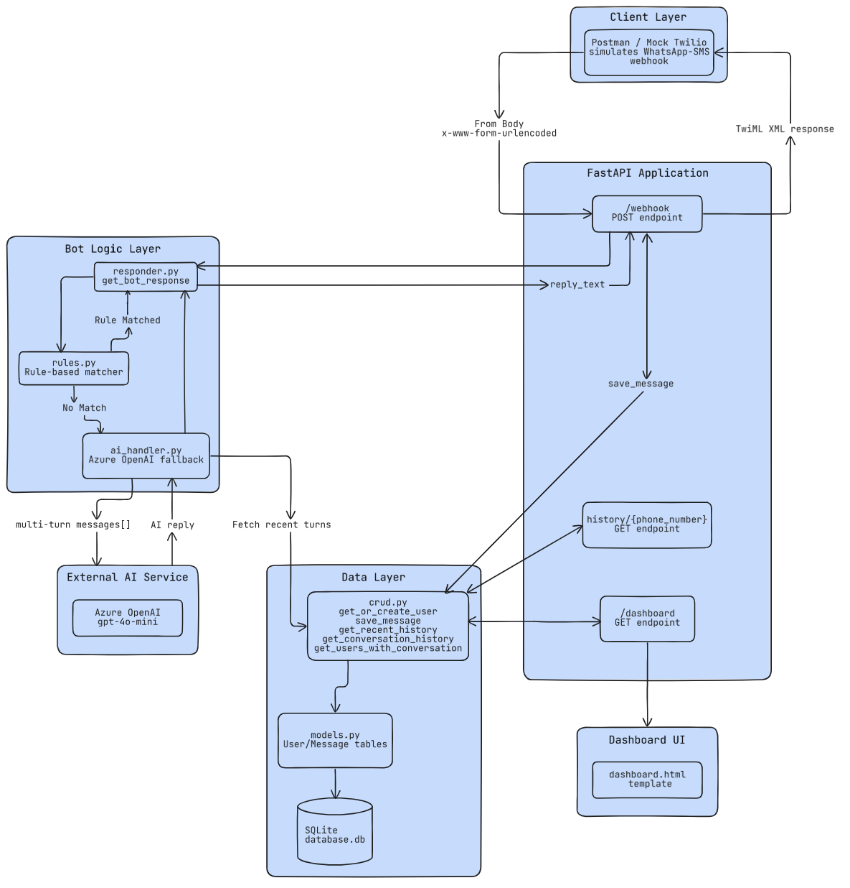
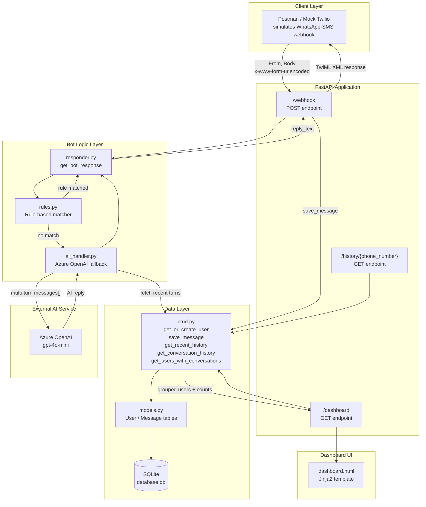

# Twilio Python Chatbot 

A conversational bot built with **FastAPI**, supporting rule-based commands, AI-powered responses (Azure OpenAI) with multi-turn conversation memory, persistent conversation storage, and a simple web dashboard — built as part of an AI Trainee training project at Imperium Dynamics.



---

## Table of Contents

- [Overview](#overview)
- [Important Note: Mocked Twilio Layer](#important-note-mocked-twilio-layer)
- [Architecture](#architecture)
- [Tech Stack](#tech-stack)
- [Project Structure](#project-structure)
- [Setup Instructions](#setup-instructions)
- [Environment Variables](#environment-variables)
- [Running the App](#running-the-app)
- [Testing the Webhook (Mock Twilio via Postman)](#testing-the-webhook-mock-twilio-via-postman)
- [API Endpoints](#api-endpoints)
- [Database Schema](#database-schema)
- [Dashboard](#dashboard)
- [Conversation Memory](#conversation-memory)
- [Running Tests](#running-tests)
- [Known Limitations](#known-limitations)
- [Future Improvements](#future-improvements)

---

## Overview

This project implements all 6 phases of the Twilio Python Chatbot Training Project:

| Phase | Description | Status |
|-------|-------------|--------|
| 1 | Learn Twilio (account, SMS vs WhatsApp, webhook) | ✅ (mocked — see note below) |
| 2 | Echo Bot (Flask/FastAPI webhook) | ✅ |
| 3 | Rule-Based Bot (Hi, Help, Time, Date, About, Services) | ✅ |
| 4 | AI Chatbot (Azure OpenAI integration) | ✅ |
| 5 | Store Conversations (Users & Messages tables) | ✅ |
| 6 | Simple Dashboard (optional) | ✅ |

Additional features beyond the base spec:
- **Multi-turn conversation memory** — the AI fallback uses the last 5 turns of conversation history per phone number, so the bot can reference earlier context within a conversation.
- **Grouped, searchable dashboard** — users are grouped with message counts and expandable conversation views, with partial phone-number search.
- **Automated test suite** — 23 tests covering rule matching, AI handler (mocked), webhook behavior, TwiML escaping, database persistence, and dashboard filtering.

---

## Important Note: Mocked Twilio Layer

During Phase 1, real Twilio, Plivo, and Vonage account signup/verification were all found to be blocked for Pakistani phone numbers (Twilio's Lookups/Verified Caller ID flow, geo-permission restrictions, and repeated "too many attempts" rate limits on signup verification), even when routing through a company VPN. Multiple providers were attempted before concluding this is an infrastructure-level blocker, not a fixable configuration issue on this end.

**Decision:** the Twilio webhook layer was simulated locally using Postman/cURL, sending HTTP POST requests with the same `application/x-www-form-urlencoded` payload structure (`From`, `Body`) that Twilio sends to a webhook, and returning the same TwiML XML response format Twilio expects.

This preserves all the actual learning outcomes of the project — REST APIs, webhooks, database CRUD, AI integration, environment variables — since none of that logic depends on Twilio's infrastructure actually being reachable. The moment real Twilio access is available, this backend requires **zero code changes** — only pointing a real Twilio phone number/WhatsApp Sandbox webhook URL at the deployed `/webhook` endpoint.

---

## Architecture



**Request flow:**
1. A message (`From`, `Body`) hits `POST /webhook`, simulating a Twilio-forwarded SMS/WhatsApp message.
2. `responder.py` first checks `rules.py` for a known command (Hi, Help, Time, Date, About, Services) — these are stateless and return instantly.
3. If no rule matches, the message is forwarded to `ai_handler.py`, which pulls the last 5 turns of conversation history for that phone number and sends the full multi-turn context to Azure OpenAI.
4. The response (rule-based or AI-generated) is saved to the database, tied to the sender's phone number.
5. A TwiML XML response is returned, matching exactly what Twilio expects from a webhook.

---

## Tech Stack

- **Python 3.x**
- **FastAPI** — web framework and webhook handling
- **Uvicorn** — ASGI server
- **SQLAlchemy + SQLite** — database ORM and storage
- **Azure OpenAI (gpt-4o-mini)** — AI-generated responses
- **Jinja2** — dashboard templating
- **Pytest** — automated testing
- **Postman** — mock Twilio webhook testing

---

## Project Structure

```
twilio-chatbot-project/
├── app/
│   ├── main.py                      # FastAPI app, webhook + history endpoints
│   ├── config.py                    # Environment variable loading
│   ├── database.py                  # SQLAlchemy engine/session setup
│   ├── models.py                    # User, Message table schemas
│   ├── crud.py                      # Database CRUD operations
│   ├── bot/
│   │   ├── rules.py                 # Phase 3: rule-based command matching
│   │   ├── ai_handler.py            # Phase 4: Azure OpenAI integration + memory
│   │   └── responder.py             # Decides rule-based vs AI, builds TwiML
│   └── dashboard/
│       ├── routes.py                # Phase 6: dashboard route
│       └── templates/
│           └── dashboard.html
├── tests/
│   ├── conftest.py                  # Shared isolated test database fixtures
│   ├── test_rules.py
│   ├── test_ai_handler.py
│   ├── test_webhook.py
│   └── test_dashboard.py
├── requirements.txt
├── .env.example
├── .gitignore
├── pytest.ini
├── Twilio_Project.png                # Architecture diagram
└── README.md
```

---

## Setup Instructions

### 1. Clone the repository
```bash
git clone https://github.com/uma1r111/twilio-chatbot-project.git
cd twilio-chatbot-project
```

### 2. Create and activate a virtual environment
```bash
python -m venv .venv
# Windows
.venv\Scripts\activate
# macOS/Linux
source .venv/bin/activate
```

### 3. Install dependencies
```bash
pip install -r requirements.txt
```

### 4. Configure environment variables
Copy `.env.example` to `.env` and fill in your Azure OpenAI credentials:
```bash
cp .env.example .env
```

---

## Environment Variables

| Variable | Description |
|----------|-------------|
| `API_VERSION` | Azure OpenAI API version, e.g. `2024-05-01-preview` |
| `DEPLOYMENT_NAME` | Azure OpenAI deployment name, e.g. `gpt-4o-mini` |
| `ENDPOINT_URL` | Your Azure OpenAI resource endpoint URL |
| `AZURE_OPENAI_API_KEY` | Your Azure OpenAI API key |

If these are missing, rule-based commands still work; the AI fallback returns a graceful "not configured" message instead of crashing.

---

## Running the App

```bash
uvicorn app.main:app --reload
```

The app runs at `http://127.0.0.1:8000`.

---

## Testing the Webhook (Mock Twilio via Postman)

Since real Twilio access is unavailable (see [note above](#important-note-mocked-twilio-layer)), incoming messages are simulated via Postman:

1. Set request type to **POST**, URL: `http://127.0.0.1:8000/webhook`
2. Body → **x-www-form-urlencoded**
3. Add key-value pairs:
   - `From` → `whatsapp:+923001234567`
   - `Body` → `Hi`
4. Send — you'll receive a TwiML XML response, and the terminal will log the incoming message.

---

## API Endpoints

| Method | Endpoint | Description |
|--------|----------|--------------|
| `POST` | `/webhook` | Receives incoming message (`From`, `Body`), returns TwiML reply |
| `GET` | `/history/{phone_number}` | Returns full conversation history (JSON) for a phone number |
| `GET` | `/dashboard` | HTML dashboard — stats, grouped conversations, search |
| `GET` | `/dashboard?phone=<partial>` | Dashboard filtered by partial phone number match |

---

## Database Schema

**`users`**
| Column | Type | Description |
|--------|------|-------------|
| `id` | Integer (PK) | Auto-increment ID |
| `phone_number` | String (unique) | Sender's phone number, e.g. `whatsapp:+923...` |
| `first_seen` | DateTime | Timestamp of first message |

**`messages`**
| Column | Type | Description |
|--------|------|-------------|
| `id` | Integer (PK) | Auto-increment ID |
| `user_id` | Integer (FK → users.id) | Links message to sender |
| `incoming_message` | Text | The user's message |
| `bot_response` | Text | The bot's reply |
| `timestamp` | DateTime | When the message was processed |

---

## Dashboard

Visit `http://127.0.0.1:8000/dashboard` to see:
- Total users and total messages (stat cards)
- Users grouped with per-user message counts
- Expandable rows showing each user's full conversation
- Search by partial phone number

---

## Conversation Memory

The AI fallback path (Phase 4) is context-aware: before calling Azure OpenAI, the last **5 turns** of conversation history for that phone number are pulled from the database and included as prior `user`/`assistant` messages, so the model can correctly answer follow-up questions like *"What did I say my name was?"* within an ongoing conversation.

Rule-based commands (Hi, Help, Time, etc.) are intentionally stateless and skip the history lookup, since they don't need context — this avoids an unnecessary database query on every message.

---

## Running Tests

```bash
pytest tests/ -v
```

23 tests covering:
- Rule-based command matching (case/whitespace insensitivity, all commands, unmatched fallback)
- AI handler behavior (success, missing credentials, empty response, exceptions, conversation history construction) — Azure OpenAI is mocked, no real API calls or credentials needed
- Webhook behavior (TwiML structure, XML escaping of special characters, database persistence, per-user isolation)
- Dashboard (stat totals, per-user message counts, singular/plural labels, partial phone search, empty state)

Tests use an isolated in-memory SQLite database and never touch the real `database.db`.

---

## Known Limitations

- **Twilio/Plivo/Vonage account access is blocked** for this developer's region at the time of writing — the webhook is exercised via mocked Postman requests instead of a live SMS/WhatsApp number. See [note above](#important-note-mocked-twilio-layer).
- **No rate limiting** — a phone number could currently send unlimited messages/AI calls with no throttling.
- **No structured logging** — the app currently uses `print()` statements rather than a proper logging framework.
- **No authentication** on `/dashboard` or `/history` — anyone with network access to the app can view all conversations.

---

## Future Improvements

- Swap mock Postman testing for a real Twilio number/WhatsApp Sandbox once account access is resolved (no code changes required — only webhook URL configuration).
- Add per-phone-number rate limiting to prevent abuse.
- Replace `print()` logging with Python's `logging` module.
- Add basic authentication to the dashboard.
- Migrate from SQLite to PostgreSQL for production deployment (Azure Database for PostgreSQL, matching prior project infrastructure).
- Deploy to Azure Container Apps (Docker + ACR), consistent with prior project deployment pattern.
- Add Whisper integration for transcribing WhatsApp voice notes before processing.
